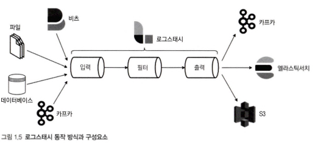
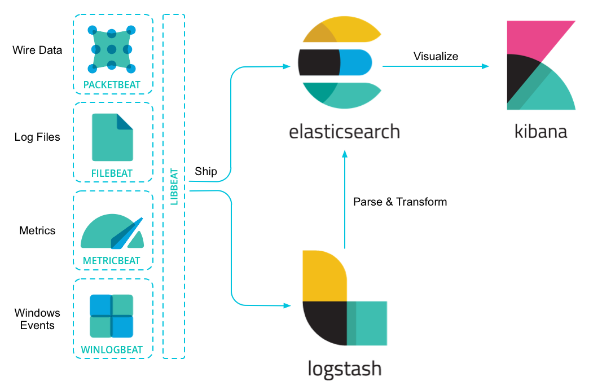
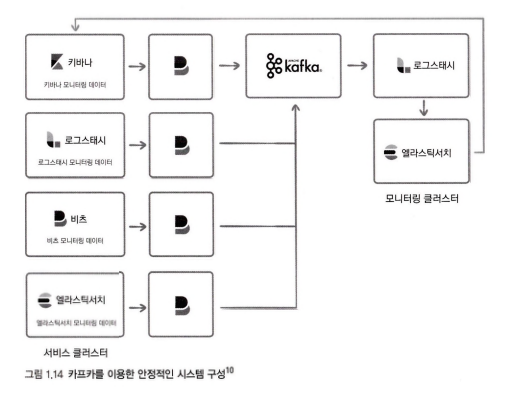
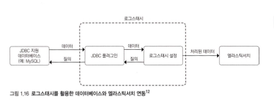

# 1. 엘라스틱 스택의 구성 요소

데이터 수집, 가공, 저장, 분석, 시각화에 필요한 모든 소프트웨어를 갖추고 있다.

1. 비츠, 로그스태시
    
    데이터를 수집하고 가공하는 역할
    
2. 엘라스틱 서치
    
    저장하고 분석하는 역할
    
3. 키바나 
    
    엘라스틱 서치에 저장된 데이터를 시각화하고 모니터링하는 역할
    
- 상용 라이선스를  유료 구입할 경우, 그래프 분석, 머신러닝 같은 고급 기능도 가능.

## 1. 엘라스틱 서치 : 분산 검색 엔진

### 검색 엔진이란?

내부적으로 각 도큐먼트를 인덱싱하고 빠르게 검색하는 데 사용하는 기술로, 검색 엔진을 이용해 구글, 네이버 같은 서비스를 만들게 된다. 

### 엘라스틱 서치란?

1. **엘라스틱 서치는 모든 레코드를 JSON 도큐먼트 형태로 입력하고 관리하고 있으며, 일반적으로 데이터베이스와 마찬가지로 쿼리한 결과에 대해 일치하는 원본 도큐먼트를 반환한다.**

1. **텍스트 외에도 숫자, 날짜, IP 주소, 지리 벙보 등 다양한 데이터 타입을 지원**하며, 이에 최적화되어 있다. 검색 엔진이면서 NoSQL 데이터 베이스라고 생각하면 좋다.
    
    
- 텍스트나 도큐먼트의 경우, 인덱싱 시점에 분석을 거쳐 용어 단위로 분해되고, 역인덱스 사전을 구축한다.
- 숫자나 키워드 타입의 데이터들을 엘라스틱 서치 집계를 위해 집계에 최적화된 컬럼 기반 자료구조를 저장한다.

1. **최적화된 자료구조들을 바탕으로 병렬 처리나 분산 처리를 할 수 있다.**
    
    엘라스틱 서치가 다른 RDB, NoSQL 가 빠른 검색과 집계 성능을 실현하는 이유는 검색 엔진인 동시에 데이터베이스이기 때문이다.
    
    이론적으로 충분한 크기의 엘라스틱서치 클러스터가 구성되어 있다면 데이터의 양과 무관하게 1초 이내의 응답 속도를 기대할 수 있다. 몽고디비와 같은 도큐먼트 기반 NoSQL 과 유사하지만, 이런 다른 NoSQL 제품을 압도하는 검색 기능과 성능을 가지고 있다.
    
2. **스코어링 즉, 유사도 스코어를 기반으로 한 정렬을 제공한다.** 
    
    복잡한 문자열 콘텐츠에서 검색을 수행할 때 큰 효과를 보인다. 이 외에도 다양한 스코어링 방법을 포함해 사용자가 정렬 방식을 다양하게 정의할 수 있다는 특성은 용도에 따라 큰 장점이 될 것이다.
    

### 엘라스틱 서치 클러스터 - 분산 시스템으로서의 장점

- 분산 시스템으로서 엘라스틱 서치는 복수의 루씬 인스턴스를 병렬로 배치하고 분산 처리해 검색 속도를 무한히 확장 할 수 있게 했다.

- 노드 간 복제 기능을 통해 일부 노드가 다운되더라도 정상적으로 서비스를 지속할 수 있게 했다.

- 모든 통신을 REST API를 이용하도록 만들어 프로그래밍 언어와 무관하게 사용자가 쉽게 접근할 수 있도록 활용성을 높였다.

### 단점 및 신경 써야 할 점

1. 저장공간이 크게 압축되지 않고 시스템 리소스를 많이 사용하기에 일반적인 범용 데이터베이스처럼 사용하기에는 무리가 있다.
    
    특히, 저장된 데이터를 부분적으로 수정, 삭제하는 작업은 내부적인 관점에서 보면 효율적이지 못하므로, 시간에 따라 데이터가 발생하며, 이미 발생한 데이터는 변하지 않는 시계열 데이터 유형을 다루기에 좋다.
    
2. **DSL(Domain Specific Language) 쿼리를 채용하는데, JOIN 쿼리가 사실상 어렵기 때문에 반정규화를 기본으로 모델링해야 한다.**
3. 인덱스가 불변의 자료구조이기 때문에 도큐먼트를 수정하거나 삭제할 경우에 비용이 저렴하지 않다.

### 엘라스틱 서치를 사용하는 목적

- 대용량 데이터에 대한 빠른 검색과 집계가 필요한 경우
    
    위와 같은 단점들은 필요한 수준의 대량 데이터를 처리할 때 일반적으로 용인되는 제약인데, 이와 같은 것들이 검색 성능을 끌어오르기 위해 어느 정도 트레이오프로 볼 수 잇는 경우에 엘라스틱 서치를 고려해볼 수 있다.
    

## 2. 키바나: 시각화와 엘라스틱서치 관리 도구

### 엘라스틱 서치에서 어떻게?

엘라스틱 서치는 사용자의 모든 입력을 REST API  형태로 받아들이기 때문에 별도의 드라이버 라이브러리가 없더라도 웹 브라우저나 curl 명령 등 친숙한 도구들을 이요해 기능을 활요할 수 있다. 하지만 복잡한 요청을 일일이 작성하기에 다소 불편할 수 있는데, 이 부분을 키바나가 해소 시켜 준다.

### 특징 및 활용점

- 키바나는 엘라스틱 서치에 대한 대부분의 관리 기능, API 를 실행할 수 있는 콘솔, 솔루션 페이지들, 그리고 스택의 각 구성요소들을 위한 모니터링 페이지 등으로 활용된다.

- 시각화와 대시보드
    
    다양한 차트, 테이블, 지도 등의 다양한 시각화 요소들을 클릭 몇 번으로 쉽게 구성 가능.
    
    시각화 요소들을 한 화면에 마음대로 배치하고 실시간으로 업데이트할 수 있는 대시 보드 
    

- 실시간 모니터링이 가능하고, 데이터 분석이 가능

- **프레젠테이션을 만들듯이 시가화를 구성할 수 잇는 캔버스,**
    
    **서버에 접속해 tail 명령을 사용하듯 실시간으로 인덱싱되는 로그를 지속적으로 확인하고 검색할 수 있는 로그,**
    
    **애플리케이션의 성능 모니터링을 위한 APM 과 보안 이벤트를 관제할 수 있는 SIEM 등 강력한 솔루션**들이 포함되어 있다.
    

*tail 명령 : 리눅스에서 tail 명령어는 일반적으로 로그와 같이 시간에 따라 변하는 파일들을 grep과 같은 명령어로 조합해서 실시간으로 업데이트되는 로그를 분석하는데 많이 사용*

- 새 버전 나올 때 마다 많은 기능이 추가되는 편

## 3. 로그 스태시 : 이벤트 수집과 정제를 위한 도구

데이터 적재에는 변경되는 상황에 맞춰 꾸준히 모니터링을 해야 하며 개선도 필요하다. 이를 로그 스태시가 가능하게 한다.

1. 로그, 메트릭, 웹 애플리케이션 등 다양한 소스로부터 로그를 수집할 수 있다.
2. 필터 기능을 이용해 비정형이나 반정형 데이터를 분석하기 쉬운 형태로 정제할 수 있다.
3. 엘라스틱서치 외에도 다양한 플랫폼으로 정제된 데이터를 내보낼 수 있다.

- 별도의 코딩 없이 간단한 설정만으로 로그를 가공할 수 있다. 확장 가능한 200개 이상의 플러그인 덕분에 설정의 대부분은 플러그인 사용 방법인데 그 사용법이 크게 어렵지 않다.
- 커스텀 애플리케이션과 로그스태시를 조합해 사용하는 경우도 가능하지만, 가급적 로그스태시만으로 구성하는 방식이 관리나 안정성 측면에서 장점이 많다.

### 동작 방식과 구성 요소

- 형식에 무관하게 데이터를 동적으로 수집, 변환, 전송하는 구조로 되어 있음.
- 비구조적인 데이터에서 구조를 도출하며, IP 주소에서 위치 정보 좌표를 해독하고 민감한 필드를 익명화하거나 제외시키는 등의 전반적인 작업을 쉽게 해준다.

### 장점

1. 엘라스틱 서치의 인덱싱 성능을 최적화하기 위한 배치 처리와 병렬 처리가 가능하다.
2. 영속적인 큐를 사용해 현재 처리 중인 이벤트의 최소 1회 전송을 보장해준다.
3. 유동적인 처리 방식으로 인해 수집 중인 데이터양이 급증하는 부하 상황에서도 안정성을 보장해준다. 로그스태시가 아닌 커스텀 애플리케이션으로 구현할 경우 신경 써야 할 부분이 많고 문제 발생 시 디버깅이나 튜닝이 쉽지 않다는 점에서 로그스태시의 큰 강점이다.
4. 잘 알려진 제품들의 경우, 이미 만들어지 ㄴ플러그인이나 모듈을 활용할 수 있다.

## 4. 비츠: 엣지단에서 동작하는 경량 수집 도구

### 비츠란?

파일 비트, 메트릭비트 등 경량 수집기 비츠

각 비트는 로그 수집, 시스템 지표 수집 등 특정 목적에 최적화된 에이전트이며, 가볍기로 유명한 고랭으로 작성되었다. 

1. 로그스태시 수준의 복잡한 이벤트 가공은 지원하지 않아 가볍다.
2. 각 서비스 호스트에 비교적 부담 없이 설치 할 수 있다.

### 동작 구조

### 비츠 VS 로그스태시

이벤트 정보를 수집하기 위해서는 실제 서비스가 동작하는 호스트에 수집기를 설치해야 하는 경우가 많은데, 로그스태시는 다양한 필터와 설정을 지원하는 만큼 무겁기 때문에, 이러한 목적으로는 활용도가 떨어질 수 가 있다.

이러한 양쪽의 장점을 활용하기 위해 비츠와 로그스태시를 혼합해 많이 사용한다. 흔히 **비츠에서 각 서비스 호스트의 정보를 수집하며, 로그스태시에서 이를 취합하고 가공해 엘라스틱서치로 전송하는 형태의 아키텍처가 많이 사용**된다.

### 비트 종류

용도별로 최적화된 경량 에이전트로 제공되며, 특성과 성격에 맞는 다양한 비트들이 존재

특정 비트는 잘 알려진 다수의 서비스에 대한 모듈을 제공한다. 모듈에는 수집 설정 프리셋, 샘플 대시보드 등이 포함되므로 별도의 설정 과정 없이도 손쉽게 이벤트를 수집할 수 있다.

- 오딧비트
- 메트릭비트
- 파일비트
- 패킷비트
- 하트비트
- 윈로그비트

## 5. 기타 솔루션

- 애플리케이션 성능 모니터링을 위한 APM
- 보안 이벤트 분석을 위한 SIEM
- 컨테이너나 다수의 서비스를 쉽게 모니터링하기 위한 인프라 모니터링
- 등등

# 2. ELK 스택의 용도

### 1. 전문 검색 엔진

- 전문 full text 은 단순한 문장부터 뉴스 기사나 논문 등 다양한 글의 전체 내용을 의미한다. 도큐먼트 수가 조금만 많아도 인덱스의 도움이 없이 빠른 검색이 불가능에 가깝다.
    
    용어 단위로 분석해 인덱싱해두고 이를 기반으로 검색을 수행하는 역인덱싱 기법을 활용해 이러한 전문을 빠르고 정확하게 검색할 수 있다.
    

- 역인덱싱이라는 기술 자체는 잘 알려져 있고,단순하게 보면 구현이 크게 어렵지는 않다.
    
    하지만, 실제 검색 서비스를 만들기 위해서 고려해야 할 사항이 한 두 가지가 아니다.
    
    **1) 원문을 어떻게 수집하고,**
    
    **2) 어떤 방식으로 분석해 용어를 만들고,**
    
    **3) 검색 시에 어떤 기준으로 유사도를 측정하고,**
    
    **4) 어떤 문서를 결과 상단에 위치시킬지와 같은 작업은 단순하지 않다.**
    
    ⇒ 이에 엘라스틱 서치는 용어 분석을 위한 다양한 언어별 분석기가 준비되어 있다.
    
    ⇒ 유사도 스코어링을 위해서도 다양한 방법을 제공
    
    ⇒ 로그스태시를 이용해 도큐먼트 수집 단계에서부터 도움을 줌
    
    ⇒ 키바나를 이용해 별도의 UI 없이도 검색 동작을 테스트할 수 있음.
    
- 전문 검색 엔진 외에도 레거시 관계형 데이터 베이스에 대한 외부 검색 엔진으로 활용될 수 있음.
    
    이때, 엘라스틱서치에 원문을 저장할 필요가 없기에 큰 용량을 차지하지는 않으면서도 빠른 검색 성능을 기대할 수 있다.
    
    하지만 굳이 관계형 데이터베이스에 원문을 유지할 필요가 없다면 관리상 하나만 사용하는 것이 편하므로 엘라스틱 서치로 완전히 전환하는 것이 좋음.
    
- **검색 엔진 용도로 엘라스틱서치를 활용할 때는 일반적으로 도큐먼트의 양이 다른 용도에 비해 많지 않기 때문에 상대적으로 작은 클러스터 크기로도 충분한 활용이 가능하며 [레플리카](https://jiseok-woo.tistory.com/8) 수를 늘려 동일 인덱스에 대한 검색 성능을 높일 수 있다.**

### 2. 로그 통합 분석

엘라스틱 스택은 **여러 장비와 서비스에서 발생하는 로그들을 실시간적으로 추적, 통합, 검색하는 데 최적화된 솔루션**이다.

- 시스템과 호스트, 쿠버네티스, 아파치, MySQL, 윈도우 같은 다양한 환경에서 생성되는 로그를 별도의 복잡한 구성 없이도 바로 수집 가능하다.

### 왜 쓸까?

애플리케이션이 복잡해져서 로그의 발생량이 많아지고, 복수의 서비스가 연계되어 동작한다면 로그의 발생 위치를 모두 기억해야 할뿐만 아니라, 발생 순서를 추적하기도 어려다.

또한, 이러한 로그는 커스텀 애플리케이션 외에 운영을 위해 사용되는 여러 서비스와 기반 시스템에서도 발생되기 때문에 서비스가 조금이라도 커진다면,

단순히 여러 창에 유닉스 tail 명령을 이용해 로그를 추적하는 방식은 한계에 부딪히게 된다.

### 어떻게?

1. **비츠**
    
    적은 리소스로 각 장비의 로그들을 빠르게 수집
    
- 엘라스틱에서 제공하는 **[ECS(Elastic Common Schema)](https://www.elastic.co/guide/en/ecs/current/ecs-reference.html) 구조에 맞춰 로그를 인덱싱한다. 이 기능은 다른 서비스들을 같은 스키마에 매핑함으로써 연관 분석을 용이**하게 해준다.
    
    **EX )** 
    
    2개의 다른 서비스가 각각 srcIP라는 필드명과 source_ip 라는 필드명으로 소스 IP 정보를 매핑했다고 가정해보자. 일반적으로 각 로그에 대한 쿼리를 별도로 작성해야 하겠지만, 표준 스키마에 맞춘다면 필드명이 동일하므로 하나의 쿼리로 검색이 가능해진다.
    
    ⇒ 커스텀 애플리케이션의 로그를 수집하더라도 ECS 포맷에 맞춘다면 엘라스틱 스택의 각종 기능들과 손쉬운 연계가 가능해진다.
    

- **EX ) 파일비트 사용**
    
    내장된 모듈을 이용해 별도의 설정 없이도 빠르게 로그를 수집할 수 있게 해준다.
    
    파일비트의 모듈은 알려진 서비스들을 정제하기 위한 파이프라인 설정, 샘플 대시보드 등을 포함하고 있기 때문이다.
    
1. **로그스태시**
    
    다양한 필터를 통해 일원화된 형태로 가공을 도움.
    

1. **엘라스틱서치**
    - 대용량 로그에 대한 빠른 인덱싱 성능과 텍스트 검색 능력은 여러 곳에 흩어진 서비스 로그들을 통합해서 연관 분석을 지원한다.
    
    - 로그 원문의 빠른 검색 후 하이라이트가 가능.
    - 날짜나 수치에 대한 범위 조회, IP 대역 조회 등이 가능.
    - 저장된 데이터들을 손쉽게 교차 분석이나 연관 분석이 가능.
        
        **RDB 와 다르게 엘라스틱 서치는 인덱스 패턴을 이용해 한 번에 여러 인덱스에서 동시에 조회가 가능하다. 이는 복잡한 JOIN 쿼리 없이도 각기 다른 서비스에서 동시간대에 어떤 로그가 발생했는지 탐색하고 공통된 요소를 찾아 문제의 원인을 분석할 수 있게 해준다.**
        
    
2. **키바나**
    
    로그 UI나 대시보드는 시계열로 발생하는 로그들을 직관적으로 모니터링할 수 있도록 도와준다.
    

### 구체적 예시

- 커스텀 애플리케이션에서 발생한 로그의 경우,
    
    로그스태시의 필터 기능이나 엘라스틱서치의 수집 파이프라인 기능으로 정제가 가능.
    
    패턴을 기반으로 원문을 가공해, 반정형의 텍스트 메시지로부터 정형화된 수치 등의 정보를 뽑아내어 인덱싱하면, 더 다양한 방식으로 로그 분석이 가능함.
    

### 3. 보안 이벤트 분석

### 4. APM : 애플리케이션 성능 분석

우리는 단순히 하나의 애플리케이션뿐만 아니라 연계되 다른 모든 서비스의 성능 정보를 모니터링해야 한다.

### **APM 이란**

엘라스택 스택의 애플리케이션 성능 모니터링 도구

단순 모니터링을 넘어 문제 원인 분석과 서비스의 상태 파악을 위한 관측성을 강화한다.

APM 전문 솔루션 대비 가장 큰 장점은 확장성이다. 기본적으로 제공되는 기능은 전문 솔루션에 비해 부족할 수 있으나, 커스터마이징을 통해 자신의 비즈니스 로직에 최적화된 모니터링 솔루션을 구축할 수 있다.

### APM 기능

1. 프로그래밍 언어별 에이전트를 통해 성능 지표 수집을 돕고 분석을 위한 UI를 제공’
2. 매트릭비트와 패킷비트를 사용하면 시스템을 비롯해 여기 연계된 다양한 서비스들의 성능 정보를 수집할 수 있게 도와줌. 문제 시점의 로그를 빠르게 확인하고 원인을 파악할 수 있는 것이다.
3. 서비스 지도를 통한 서비스 연결 관계 파악
4. 트랜잭션의 분산 추적
5. 경보 기능을 사용한 즉각적인 대응
6. 자바, 노드 PHP, 닷넷 같은 다양한 프로그래밍 언어 지원
7. 머신러닝을 사용한 비정상적인 응답 시간 탐지
8. 다양한 경로로 수집된 정보들은 컨테이너나 호스트 집합의 상태를 한눈에 확인할 수 있는 인프라 UI, 메트릭비트에서 모듈별로 제공하는 샘플 대시보드, 트랜잭션이나 오류 스택 트레이스 등을 빠르게 확인할 수 있는 APM UI 등 키바나에 제공되는 UI를 통해 분석이 가능하다.
9. 다른 도큐먼트와 마찬가지로 인덱스 형태로 저장되기 때문에 일반적인 쿼리와 집계가 가능함.
10. 키바나을 통해 수집된 지표들로 고유한 대시보드를 만들어 자신의 애플리케이션 특성에 따른 맞춤형 모니터링이 가능.
11. 유료 서브스크립션에 포함된 기능인 Watcher나 머신러닝 등의 긴으과 연계하면 장애나 이상 상황을 빠르게 파악하고 원인을 효과적으로 분석할 수 있다.

### 5. 머신러닝

데이터를 엘라스틱서치에 넣은 다음에 비지도형 머신러닝 기법을 활용해 데이터에서 패턴을 발견할 수 있다. 시계열 모델링은 시간과 관련된 데이터에서 이상 징후를 탐지하고 과거 데이터를 기반으로 동향을 예측하게 도와준다. 이런 기능을 활용해 SIEM 통합, APM 통합, 로그 통합 부문에서 비정상적인 상황을 특별한 규칙 지정 없이도 빠르게 발견할 수 있다.

- 유료 라이선스 구매 시 가능

### 6. 엔터프라이즈 데이터 버스인 카프카와 연동

카프카는 분산 데이터 스트리밍 플랫폼으로, 대량의 뎅터를 실사간으로 배포하는 데 최적화되어 있다.

카프카와 엘라스틱 스택은 데이터 수집 시점에서 많이 연계되어 사용된다.

### 사용 예

1. 비츠에서 수집한 각 장비의 이벤트를 카프카로 전송하고 이를 로그 스태시로 다시 읽어 들이는 구성
2. 카프카에 저장된 다른 시스템의 이벤트를 엘라스틱서치로 읽어 들이는 구성

### 같이 사용하는 효과

- 카프카를 사용하면 엘라스틱서치의 인덱싱 성능이 순간적으로 충분하지 않거나 로그스태시나 엘라스틱서치의 불안정으로 정상적인 인덱싱이 불가능할 때도 데이터의 유실이 방지되며 타 시스템과 데이터 연계가 손쉬워진다.

### 카프카를 이용한 안정적인 시스템 구성

### 7. 관계형 데이터베이스와 연동

로그스태시는 JDBC 입력 플러그인, 필터 등 관계형 데이터베이스와 연계할 수 있는 다양한 방법을 제공하고 있다.

- **용도**
1. 기존의 관계형 데이터 베이스에 저장된 데이터를 인덱싱
2. 입력받는 이벤트에 정보를 주입

### 효과

JDBC 인력 플러그인을 사용해 관계형 데이터베이스에 저장된 데이터를 엘라스틱 서치로 이전한다. 이때, 다음과 같은 효과가 있다.

1. RDB 만으로 처리하기 어려운 집계도 빠르고 정확하게 처리할 수 있다.
2. 텍스트 데이터의 경우 엘라스틱 서치에서는 색인만 수행하고 원문을 저장하지 않게 설정하는 방식을 이용해 저장소 용량을 아껴 쓰면서 검색 엔진의 전문 검색 기능만 활용한다.
3. JDBC 필터를 사용할 경우 관계형 데이터베이스에서 실 데이터를 불러와 매핑하는 용도로 이벤트에 ID 형태로만 기록되는 정보를 활용할 수 있다.

# 3. ELK과 타 제품과의 비교

### 1. 데이터 베이스로서 : Elastic Search VS 타 DB

|  | **엘라스틱 서치** | **몽고디비** | **MySQL** |
| --- | --- | --- | --- |
| **분류** | 검색엔진 | 도큐먼트 저장소 | RDB |
| **스키마** | 자동 생성 | 자유 | 필요 |
| **인터페이스** | REST API | 전용 프로토콜 | JDBC/ODBC |
| **분산저장** | 샤딩 | 샤딩 | 별도 제품으로 지원 |
| **트랜잭션** | 미지원 | 부분 지원 | 지원 |
| **JOIN** | 미지원 | 최근 도큐먼트 단위로 지원 시작 | 지원 |
| **특징** | 다양한 데이터 유형에 대한 빠른 검색/집계 | 높은 활용성/범용성 | 뛰어난 데이터 무결성 |

### 2. 검색 엔진으로서 : Elastic Search VS Solr

둘 다 루씬 기반으로 만들어져 상당히 유사

**Solr**

- 통합 플랫폼으로 발전하지 못함.
- 정적 데이터를 처리하기에 적합

**Solr 와 비교했을 때 Elastic Search**

- 스택의 다른 구성요소들의 도움을 받아 로그분석, 모니터링, 위치 기반 데이터 분석과 시각화에 적합
- 솔라에 비해 월등히 많은 데이터 소스와 쿼리 DSL 은물론 다양한 쿼리 파서를 지원하고 있어, 데이터 수집과 분석에 유리
- 주키퍼에 의존하지 않으므로 분산 환

### 3. Lucence 과의 비교

- Lucene 인덱스를 수평 확장할 수 있는 기능이 추가되어 있다.
- Elasticsearch 안의 각 샤드는 문서의 단일 Lucene 역색인이다.
    - 모든 샤드가 Lucene 인스턴스인 것이다.
    - 하지만, elasticsearch는 클러스터에 흩어져 있는 Lucene 그 이상이다.
        - 전체 텍스트 검색 보다 휠씬 더 많은 것을 처리할 수 있며, 구조 데이터 및 집계 데이터를 매우 빠르게 처리할 수 있다.
        - 단순히 검색을 위한 것이 아닌 모든 유형의 구조 데이터를 처리한다.

### ES

- Elasticsearch 자체는 JSON 요청을 처리하고 JSON 데이터를 반환하는 서버이다. 이를 어떻게 활용할지는 사용자에 따라 달렸다.  검색에만 국한되어있는 게 아닌 것.