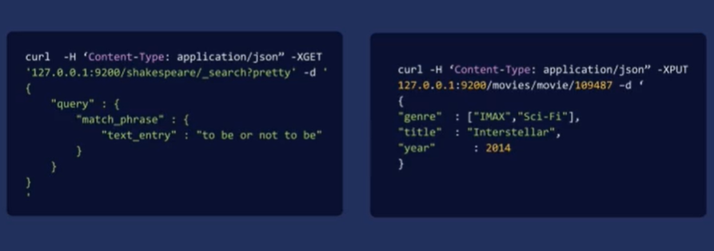
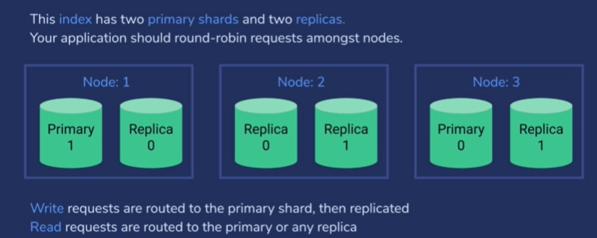
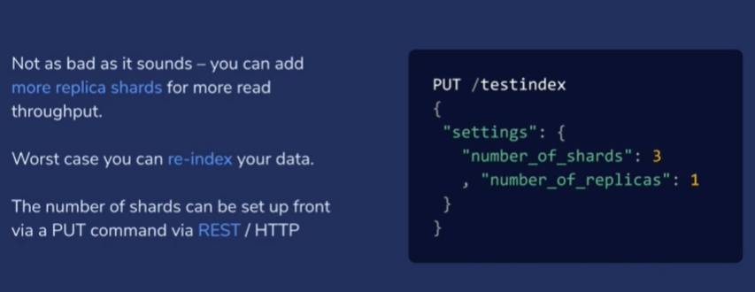

# 01 ES 이해

## 1. es 이해

## 2. http 및 RESTful API 소개

웹 브라우저는 웹 서버에 http 요청을 보내는 것처럼, **ES 에 HTTP 를 요청**한다. 즉, HTTP 요청과 응답으로 우린 ES 와 소통하는 것.

ES 요청에서는 거의 헤더는 사용하지 않는다.

:arrow_right: **ES의 RESTful api 가 작동하는 것을 다루면서, ES에 특정 언어의 세부 정보나 시스템이 얽히는 것을 방지할 수 있다.**

### Curl Command 예시
~~~
curl -H "Content-Type: application/json" <URL> -d '<BODY>'
~~~

- "Content-Type: application/json"
  - 헤더를 보면, ES는 언제나 본문 body JSON 형태임을 알 수 있다.

## 3. Elasticsearch 기본: 논리 개념
### 1. Documents
- 검색하는 대상
- text 뿐만 아니라, 모든 구조화된 데이터를 가질 수 있다.
  - 또한, es 는 json 형식의 데이터를 기반으로 작동된다.
  - json은 문자열, 숫자, 날짜 등을 포함하는 구조화된 데이터를 웹에서 깔끔하게 전송할 수 이도록 하는 인코딩 방식이다.
- 모든 문서는 고유 ID 를 가질 수 있다.
  - 직접 지정도 가능하고, 자동으로 할당도 가능하다.

### 2. Indices
- 색인 index는 es에서 쿼리할 수 있는 가장 높은 단계의 엔티티이며, 여러 documents를 포함할 수 있다.
- 색인은 각 문서 내의 데이터 유형을 정의하는 체계가 있다.
- 하나의 es와 색인에는 한 가지 유형의 문서만 사용할 수 있다. :question:

### 3. Schema
- 문서 내에 어떤 종류의 정보가 저장되는지 정의한다.

 

:exclamation:
DB로 비유하자면, 클러스터가 데이터베이스과 같은 개념이고,

색인(인덱스)는 데이터베이스의 테이블과 같은 개념이고,

문서가 그 테이블의 행인 것이다.

 

:question: 색인 자체로 정의되냐? 클러스터 설정 또는 문서 자체로 정의되냐? 그 문서가 가진 스키마 즉 데이터 유형에 관한 정보를 어디서 찾을 수 있나?

:arrow_right: **색인 또는 그 색인의 문서 유형**

색인은 데이터베이스의 테이블과 비슷해서 하나의 인덱스에 하나의 유형만을 가질 수 있다.

이는 문서가 가지는 개별 필드와 데이터 유형을 정의한다. 

전부 문서 색인 내의 유형 매핑으로 정의된다. 그리고 색인을 설정할 때 유형 매핑을 es 로 정의한다.

## 4. 단어 빈도 / 역 문서 빈도 (TF/IDF)

### 역색인
색인이 문서들에서 키워드를 뽑아낸다면,

역색인은 어떠한 데이터를 색인할 때, 단어 기준으로 색인을 수행하는 것이다. 뽑아낸 키워들을 바탕으로 그 키워드가 포함된 문서를 찾아나간다.

즉, 역색인은 '해당 검색어가 포함된' 문서에서 특정 키워드 검색어를 매핑하는 것이다.

따라서 elasticseacrch는 문서를 색인화할 때 역색인이 생성되어, 문서를 검색어 별로 분할하여 저장한다.

- 대부분의 검색 엔진이 작동하는 원리이다.
- 검색어가 어떤 문서에 있는지 뿐만 아니라, 문서 내의 위치까지 저장하여, 그 키워드가 포함된 문서를 찾아나간다.
- 역색인은 검색 색인을 통해 얻을 수 있으며, 검색 색인은 검색어를 그것이 속해 있는 문서에 매핑한다.

### TF-IDF (Term Frequency x Inverse Document Frequency)

1. TF 단어빈도
- 지정된 검색어가 한 문서 내에서 나타나는 빈도를 뜻한다. 어떠한 문서에서 space 라는 단어가 자주 사용된다면 단어 빈도가 높아진다.
2. Document Frequency 문서 빈도
- 인덱스 내의 모든 문서에 단어가 사용되는 빈도
3. Inverse Document Frequency 역문서빈도
- 문서 빈도의 역수
- space 라는 단어가 있을 때 이는 색인 전체에서 자주 쓰이지 않기 때문에 문서 빈도는 낮을 것이다. 하지만, the 는 모든 문서에서 꽤 자주 나오므로 문서 빈도가 굉장히 높을 것이다.

### Term Frequency X Inverse Document Frequency

> **단어 빈도를 문서빈도로 나눈 것. 즉, 역문서빈도 (IDF) 로 곱하는 것**

문서에서 해당 term 이 얼마나 관련있는지를 의미한다.

관련성은 해당 단어가 문서 내에서 얼마나 자주 사용되는지 뿐만 아니라

전체 색인에서 얼마나 자주 사용되는지와 비교하여 보여준다.

 

예를 들어, space 라는 단어는 우주와 관한 기사에서 높은 관련성을 가질 것이고, the 는 그렇게 높은 관련성을 나타내지는 않을 것이다. the 는 다른 문서에서도 자주 사용되는 흔한 단어이기 때문이다.

이것이 검색엔진이 작동하는 기본적인 그림이다.

어떠한 단어를 검색하면 이를 토대로 관련성이 높은 순서대로 결과를 뽑는 것이다.

## 5. ElasticSearch 색인
1. RESTful API 

ES 도 웹서버와 동일한 **HTTP 프로토콜**을 통해 작동한다. 따라서 다른 시스템에서도 ES와 소통할 수 있다. 

즉, HTTP 요청을 처리할 수 있는 언어, API, 도구 또는 환경이 있다면, ES 도 처리할 수 있다.

2. Client API's

대부분의 경우, REST 쿼리 외에 추상성 수준을 결정하는 **클라이언트 API** 가 있다.

검색 유형에 적합한 JSON 형식을 구성하거나 어떤 데이터를 삽입할지 등에 대해 직접 고민할 필요없이 클라이언트 API 를 사용하는 것이 훨씬 편리하다.

3. Analytic Tools Kibana

코드를 작성하지 않더라도 인덱스와 상호작용할 수 있게 하는 웹 기반 그래픽 UI 이다.

## 6. ElasticSearch 의 확장성

ElasticSearch 의 아키텍처가 어떻게 필요에 따라 컴퓨터 클라스터 전체로 확장할 수 있는지 알아볼 것이다.

### An Index is splic into shards

ElasticSearch 의 확장성의 핵심은 

**하나의 색인이 샤드라는 조각들로 나뉘고, 각 샤드는 Lucene 자체의 독립적인 인스턴스** 이다.

만약, 클러스터가 있는 경우, 샤드를 여러 서버에 분산시킬 수 있다. 

혹시 용량이 더 필요하다면, 클러스터에 더 많은 컴퓨터를 배치하고, 전체 색인에 샤드를 추가해 로드를 효율적으로 분포할 수 있다.

따라서, es 클러스터의 어떤 서버와 소통하면 **그 서버가 해당 검색의 관심문서를 파악하여 특정 샤드 ID 에 해시**할 수 있다. 

**특정한 문서에 해당하는 샤드를 빠르게 알아내느 수학함수를 통해 클러스터 내 적절한 샤드를 신속하게 찾을 수** 있다.

즉, 색인을 여러 샤드에 분산시키고 그 샤드를 클러스터 내 여러 컴퓨터에 배치하는 것이다.

### Primary and Replica Shards

es 가 실패에 대한 복원력을 유지하는 방법이기도 하다. 클러스터를 사용할 땐 장애를 늘 대비해야 한다.

**:question: 어떻게 처리하냐?**

- **프라이머리 샤드** : 쓰기 요청이 처음 보내질 곳. 색인 데이터의 원본
- **레플리카 샤드** : 읽기 요청을 처리할 수 있는 곳. 복제본
  
- 프라이머리 샤드에 쓰기 처리 한 후 다음 그 데이터가 읽기 요청을 처리할 수 있는 레플리카 샤드로 복사된다.

**:question: 이를 어떻게 셋업되었나?**

es 가 다 스스로 해준다.

Lucence 외에도 elastic search 의 장점은 이러한 예이비자원을 스스로 관리한다는 점이다.

만약 두 개의 프라이머리와 두 개의 레플리카를 가진 색인을 원하고 세 개의 노드를 부여하면 이와 그림과 같이 설정 된다.

색인 데이터의 원본인 두 개의 프라이머리 샤드와 이의 복제본인 두 개의 레플리카 샤드를 가진 색인이 있다. 

각 노드는 설치된 es 라고 생각하면 된다.

일반적으로 클러스터 내 물리적 서버당 하나의 노드가 설치된다. 원한다면 서버당 두 개 이상의 노드를 사용할 수 있지만 보편적 방식은 아니다.

만약 클러스터 내 어떤 노드가 작동 중단이 된다면, 사용자로서 알아챌 수 도 없게, 그 실패를 처리한다.

 

이때, 실패가 발생한다면 어떻게 할까?

예를 들어 노드 1이 전원공급장치나 디스크 문제 등으로 작동하지 않는다고 가정하자.

이 경우, 프라이머리 샤드1과 레플리카 샤드 0 을 잃게 된다.

하지만 샤드1의 복제본은 노드2, 3 에 배치되어 있기 때문에 큰 문제가 되지 않는다.

노드 1이 사라져도 노드 2, 3에 있는 레플리카 노드 중 하나를 선택해 새로운 프라이머리 노드로 지정한다. 

노드 1에서 발생한 손실을 회복할 때까지 계속해서 새로운 데이터를 받고, 읽기 요청을 처리하며, 계속해서 작업을 진행할 수 있게 된다.

이러한 스키마를 사용하면 시스템은 내결함성을 갖게 된다.

### 유의 사항

1. 복원력을 높이기 위해 홀수의 노드를 사용하는 것이 좋다.
2. 클러스터 내 프라이머리 샤드의 수를 나중에 변경할 수 없다. 인덱스를 생성할 때 정해야 한다.
3. 클러스터 내 여러 노드 간에 어플리케이션으로서의 요청을 라운드 로빈(요청을 각 노드에 차례대로 순차적으로 전달하는 방식. 균등하게 처리.)하자. :question: 다른 알고리즘을 적용한 사례 없나
   1. 초기 트래픽으로 로드가 분산되어, 어플리케이션을 통해 여러 노드에 걸쳐 요청을 분산시키거나 일종의 로드 밸런서 장치를 사용할 수 있다.

**:question: 새 데이터를 쓰거나 클러스터에서 데이터를 읽을 때 어떤 일이 일어나냐?**

쓰기 요청할 새로운 문서를 es에 색인화한다고 하자.

그럼 어떤 노드와 소통하더라도 **색인화하려는 해당 문서의 프라이머리 샤드 위치를 보여준다.**

다시 말해 그 노드는 프라이머리 샤드가 있는 위치를 나타낸다.

노드 위치와 상관없이 그 곳에 데이터를 작성하고 프라이머리 샤드에 색인화한다. 그러면 해당 샤드의 레플리카에 자동으로 복제되고, 프라이머리 샤드나 레플리카 중 하나에 요청을 하면 되기 때문에 이제 읽기 요청은 더 신속해질 것이다.

이는 읽기 로드를 휠씬 효율적으로 분산시킨다.

:arrow_right: **레플리카 수가 많을 수록, 전체 클러스터에 대한 읽기 용량이 증가한다.**
:arrow_right: **그러나, 프라이머리 샤드의 수가 많을 수록 쓰기 용량은 제한될 것이다.**

es 를 사용하는 많은 애플리케이션은 새로운 문서에 대한 색인화보다 읽기 요청을 휠씬 더 많이 받기 때문에 이는 괜찮을 것이다.

어플리케이션에서 읽기 용량을 늘리려 클러스터에 레플리카를 이후에 추가하면 쓰기 용량도 늘어나기 때문에 약간의 부담이 생긴다. 큰 문제는 아님. 쓰기 용량을 추가할 필요가 있으면 언제든지 데이터를 새로 색인화해서 붙여넣으면 된다.

이때 합리적으로 예상되는 트래픽증가량까지 처리할 수 있는 충분한 프라이머리 샤드를 확보해놔야 한다. 

### 샤드 설정

PUT 요청으로 이뤄지며, 색인의 이름과 설정 구조, 프라이머리 샤드와 레플리카 수를 나타내는 JSON 을 지정해야 한다.

⇒ 총 6개의 샤드  (3 + 3*1)

:arrow_right: **프라이머리와 레플리카 샤드, es 가 그 샤드를 클러스터 내 여러 서버에 위치한 노드에 분산해 복원력을 제공한다는 것이 핵심이다.**

