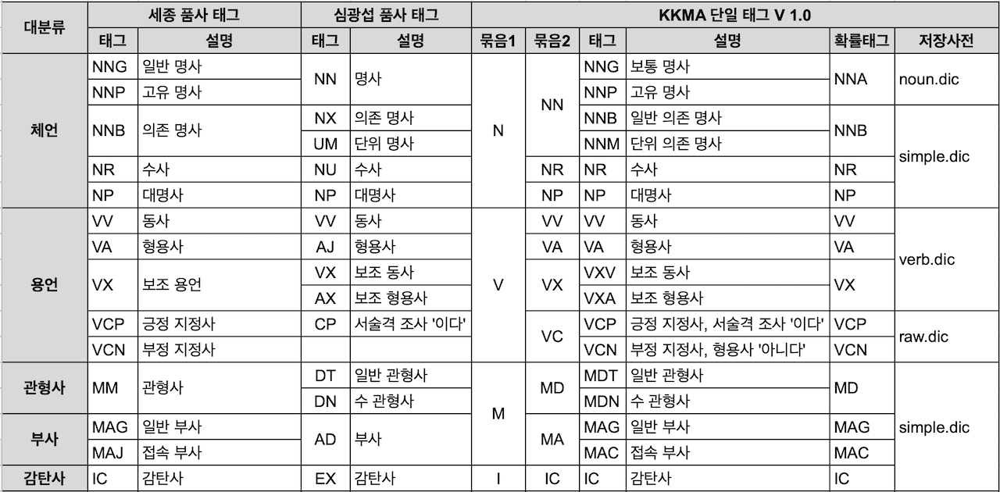

# Analyzer

## 1. mapping

데이터를 어떤 형식으로 어떻게 저장할지, 

어떻게 색인화하고 분석할 것인지를 

elastic 에 알려 주는 것. 

=> 스키마

<br>

- 다이나믹 매핑 : es 는 **합리적인 고려된 기본값**을 가지고 있고 데이터의 속성에 따라 필요한 작업을 추론할 수 있다. 매핑은 안한 데이터를 넣을 때 es 가 알아서 데이터 타입을 지정해서 insert 된다.

### Common Mappings

1. Field types
- string, byte, short, integer, long, float, double, boolean, date …
    
2. Field Index
- 매핑을 통해 필드의 full-text search 여부를 정할 수 있다.
- `“index”: “not_analyzed”` 를 하면, 해당 정보를 full-text search 의 대상으로 포함하지 않고 태그가 추가되는 보조 정보로만 사용하려는 것.
    
3. Field Analyzer
   1. character filter
   2. tokenizer : 토큰화 시키기
   3. token filter 
      1. 모든 언어 소문자화 시키기. 색인에 사용할 언어 지정. 어간 규칙, 동의어, 중지 단어 등의 작업을 할 수 있도록.
      2. standard : 단어 경계선에서 분할
      3. simple : 글자가 아닌 곳에서 단어를 분할하고 소문자화 함.
      4. whitespace : 공백에서 단어를 분할하지만 소문자화는 하지 않음.

### 토큰화

공백이나 구두점 또는 특수 문자를 기준으로 문자열을 분할할 방법을 지정하는 것을 말한다.

**token_chars**
<br>
- letter : 언어의 글자로 분류되는 문자
- digit : 숫자로 분류되는 문자 
- whitespace : 띄어쓰기 또는 줄바꿈 문자 등 공백으로 인식되는 문자
- punctuntation : 문장 부호
- symbol : 기호
- custom : custom_token_chars 설정을 통해 따로 지정한 커스텀 문자

## 2. Analyzer 

### 1. 대상
- 검색어 검색 쿼리
  - search analyzer
- 색인화 대상

** 각각 다른 필드에 다른 Analyzer 를 적용할 수도 있음.

### 2. 구성
- 애널라이저는 9개 이상의 캐릭터 필터, 1개의 토크나이저, 0 개 이상의 토큰 필터로 구성된다.
- 사용자는 custom 하게 캐릭터 필터, 토크나이저, 토큰 필터를 조합하여 구성할 수 있다.
- es는 애널라이저의 동작을 테스트할 수 있는 api 를 제공한다.

### 3. 동작
- 캐릭터 필터 -> 토크나이저 -> 토큰 필터 순서로 수행된다.

:star:
1. 애널라이저는 입력한 텍스트에 캐릭터 필터를 적용하여 문자열을 변형시킨다.
2. 토크나이저를 적용하여 여러 토큰으로 쪼갠다.
3. 쪼개진 토큰의 스트림에 토큰 필터를 적용해서 토큰에 특정한 변형을 가한 결과가 최종적으로 분석완료된 **term** 이다.

### Character Filters
- 캐릭터 필터는 텍스트를 **캐릭터 스트림**으로 받아서 특정환 문자를 추가 변경 삭제하고 캐릭터 스트림으로 반환한다.
- 애널라이저에는 0 개 이상의 캐릭터 필터를 지정할 수 있다. 여러 캐릭터 필터가 지정됐다면 '순서대로' 수행된다.
- ex. HTML 인코딩을 제고하고 & 기호를 단어로 변환하는 등의 작업이 있다.

- 동일한 분석기를 검색 쿼리와 색인화된 정보에 적용하면 둘 사이에 있을 수 잇는 모든 차이점을 제거할수 있다.

- ex
  - '그리고' 라는 단어와 '&' 기호를 매핑하는 분석기를 검색 쿼리와 색인화 중인 데이터에 모두 적용한다면 이는 '&' 기호나 '그리고' 라는 단어 무엇을 검색하는지와 상관없이 역색인로부터 '&' 기호에 대한 결과를 받을 것이다.

### Tokenizer
토크 나이저는 캐릭터 스트림을 받아서 여러 토큰으로 쪼개어 **토큰 스트림**을 만든다. 애널라이저에는 한 개의 토크나이저만 지정할 수 있다.

1. standard tokenizer
   1. 텍스트를 단어 단위로 나누는 가장 기본적인 토크나이저다. 대부분의 문장 부호가 사라진다. 
   2. 필드 매핑에 특정 애널라이저를 지정하지 않으면 기본값으로 standard 애널라이저가 적용된다. 
      1. 스탠다드 애널라이저가 사용하는 토크나이저가 스탠다드 토크나이저다.
2. keyword tokenizer
   1. 들어온 텍스트를 쪼개지 않고 그대로 내보낸다.
   2. 토크나이저에서 특별한 동작을 수행하지 않기 때문에 쓸모없어 보이지만, 여러 캐릭터 필터, 토큰 필터와 조합하면 다양한 커스텀 애널라이저 지정이 가능하다고 한다.
3. ngram tokenizer
   1. 텍스트를 min_ngram 값 이상 max_ngram 값 이하 단위로 쪼갠다. min_gram: 2, max_gram=3으로 지정한 뒤, hello라는 텍스트를 토크나이징 하면 "he", "hel", "el", "ell", "ll", "llo" 총 5개의 토큰이 나온다.
   2. min_gram 3, max_gram 4로 지정하고 "Hello, World!"라는 문자열을 토크나이징 하면 총 21개의 토큰이 나온다. 여기에는 사실상 ‘무의미한 공백이나 문장 부호 같은 토큰’도 포함됐다. 이런 문제를 피하기 위해 ngram 토크나이저에는 **token_chars**라는 속성을 통해 토큰에 포함시킬 타입의 문자를 지정할 수 있다.


### Token Filter
토큰 필터는 토큰 스트림을 받아서 토큰을 추가, 변경, 삭제한다. 하나의 애털라이저에 토큰필터를 0 개이상 지정할 수 있다. 토큰 필터가 여러 개 지정된 경우에는 순차적으로 적용된다. 

- owercase / uppercase
- stop: 불용어 지정하여 제거
- synonym: 유의어 사전을 지정하여 지정된 유의어를 치환한다
- pattern_replace: 정규식을 사용하여 토큰의 내용을 치환한다
- stemmer: 지원되는 몇몇 언어의 어간 추출을 수행. 한국어 지원X
- trim: 토큰 전후에 위치한 공백 제거
- truncate: 지정한 길이로 토큰을 자른다.


### built in analyzer

엘라스틱서치에는 내장 캐릭터 필터, 토크나이저, 토큰 필터를 조합하여 미리 만들어 둔 다양한 내장 애널라이저가 있다.

- **standard analyzer**
    standard tokenizer + lowercase token filter로 구성된다.
    애널라이저를 지정하지 않으면 적용되는 기본 애널라이저다.
    
- **simple analyzer**
    letter가 아닌 문자 단위로 토큰을 쪼개는 tokenizer 후,  lowercase 토큰 필터를 적용한다.
    
- **whitespace**
    analyzer whitespace tokenizer로 구성된다. 공백 문자 단위로 토큰을 쪼갠다.
    
- **stop analyzer**
    standard 애널라이저와 같지만 뒤에 stop 토큰 필터를 적용해서 불용어 제거함
    
- **pattern analyzer**
    keyword 토크나이저로 구성됨. 분석하지 않고 큰 토큰을 그대로 반환

### 노멀라이저

노멀라이저는 애널라이저와 비슷한 역할을 하나, 적용 대상이 text 타입이 아닌 keyword 타입 필드라는 차이가 있다.

또한, 애널라이저와 다르게 단일 토큰을 생성한다.

노멀라이저는 토크나이저 없이 캐릭터 필터, 토큰 필터로 구성된다.

또한 캐틱터 필터와 토큰 필터를 모두 조합할 수 있는 것은 아니다.

최종적으로 단일 토큰을 생성해야 하기 때문에 글자 단위로 작업을 수행하는 필터만 사용할 수 있다.

엘라스틱서치에서 제공하는 빌트인 노멀라이저는 lowercase밖에 없다. 다른 방법으로 keyword 타입 필드를 처리하려면 커스텀 노멀라이즈를 사용해야 한다.


## 3. 텍스트 타입 필드에서의 mapping유형

### 1. keyword type

텍스트 필드가 정확히 매치되는 것을 원할 때 **매핑 시, 해당 필드를 keyword 타입을 지정한다.**

- 해당 필드에 대한 분석이 완전히 금지된다.
- 검색 결과가 정확히 일치하고 대소문자를 구분하며, 모든 항목 일치하는 결과만 반환한다.

### 2. text type

분석된 결과로 인한 결정되기를 원할 때, 부분 일치를 수행하려면,  **매핑 시, 해당 필드를 text 타입을 지정한다.**

- 택스트 유형을 사용하는 경우 해당 필드에서 실행할 **분석기**를 지정할 수 있다.
- 부분 일치 항목 중 관련도에 따라 순위가 매겨진다. 가장 관련성이 높은 최고의 매치가 결과 위에 매치될 것.


# nori analyzer
## 1. tokenizer

- **user_dictionary** : 사용자 사전이 저장된 파일의 경로를 입력합니다.
- **user_dictionary_rules** : 사용자 정의 사전을 배열로 입력합니다.
- **decompound_mode** : 합성어의 저장 방식을 결정합니다. 
  - 다음 3개의 값을 사용 가능합니다.
  - `none` : 어근을 분리하지 않고 완성된 합성어만 저장합니다.
  - `discard` (디폴트) : 합성어를 분리하여 각 어근만 저장합니다.
  - `mixed` : 어근과 합성어를 모두 저장합니다.

```java
"tokenizer" : {
        "product_tokenizer" : {
          "type": "product_tokenizer",
          "decompound_mode": "none"
        }
}
```

## 2. TokenFilter

### 불용어 제거
- `“type”:”nori_part_of_speech”`


### nori_part_of_speech
