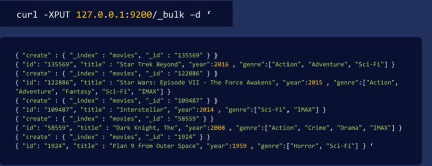

# 1. Bulk API

REST 쿼리와 JSON 형식을 사용하여 많은 문서를 한 번에 가져오는 방법

```jsx
curl -XPUT 127.0.0.1:9200/_bulk -d '
{

}'
```

### ex. bulk indexing
1. 삽입할 색인 이름과 문서의 ID를 지정한 “create” 줄부터 시작 
2. 그 다음에는 문서 자체에 대한 정보



### 왜 이런한 양식일까?
프괄적인 하나의 JSON 요청이 아닌, 각 줄을 이런 식으로 분리하는 이유는 es 는 모든 특정 문서를 주어진 샤드로 해시한다는 것을 기억해야 한다.

즉, es 는 개별 문서를 한번에 하나씩 처리해야 한다.

예로, 각 줄을 읽으며 영화 id 1355569 를 어떤 샤드로 매핑해야 할지 정한다.

그 다음 클러스터 내의 그 샤드에 정보를 넘겨준다.

그리고 '다음 줄을 처리하며 이번에는 다른 샤드로' 보내고, 다음에는 또 다른 노드로 넘긴다. 계속해서 이런 식으로 반복 진행된다.

이렇게 두 줄씩 나뉘는 형식은 내용을 전달받는 es 서버에 **어떤 문서를 어떤 샤드로 보내서 처리할지 한 번에 한줄 씩 전달하기 때문**이다.

한 번에 전부 다 처리하는 것이 아니므로 해당 양식으로 요청한다.

➡️ **즉, es 클러스터의 특정 호스트로 보내서 한 번에 한 문서씩, 살펴본 후, 어디로 보낼지 결정하고, 적절한 샤드로 보낸다.**


### 데이터 바이너리를 사용하여 미리 만든 파일에서 curl 데이터 put

```jsx
curl -H "Content-Type: application/json" -XPUT 127.0.0.1:9200/_bulk?prett
y --data-binary @movies.json
```

- 데이터를 es로 가져오는 한 가지 방법으로 이렇게 안 하고, 해당 정보를 대량 삽입 양식으로 전환하는 스크립트를 짜는 것도 있다.


