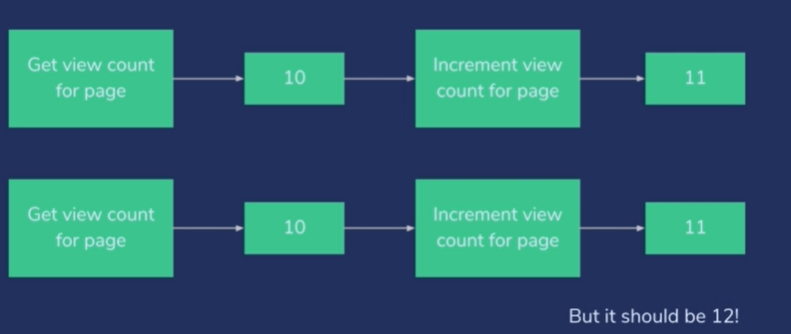

# 1. 동시성 처리

ES 와 같은 분산형 시스템을 다룰 땐 동시성 문제가 발생할 수 있다.



웹 사이트나 ES 서비스 혹은 클러스터를 동시에 접속하는 사람이 많을 경우 이러한 현상은 흔히 일어날 수 있다.

특히, 클러스터에 동시 권한이 많을 경우 생각해봐야 한다.

## 낙천적 동시성 제어

업데이트에서 버전 필드가 사용된 방식과 유사.

차이점은 단일 버전 필드 대신 **시퀀스 번호와 해당 시퀀스를 소유**하는 기본 샤드가 있다는 것.

- ES 7버전 기능

**명시적 순서번호를 사용**

- sequence number 순서 번호
- primary term 주요 용어

이를 함께 가져옴으로써 이 문서의 고유한 연대 기록을 갖게 한다.

### 동작

- ES에 무언가를 요청할 때 해당 문서의 순서 번호도 함께 반환한다.
    
    따라서 조회 수 10이 해당 문서의 주어진 순서 번호와 명시적으로 연관되어 있고,
    
    순서 번호가 주요 용어와 연관되어 있다.
    


1. 순서 번호를 9 라고 하자. 두 클라이언트가 조회수를 업데이트 하려 할 때 주요 용어 1의 순서번호 9를 바탕으로 새 조회 수를 정할 수 있다.
    
    따라서 업데이트 할 때 명시적으로 순서 번호와 주요 용어를 지정할 수 있다.
    
2. 두 사람이 동일한 순서 번호로 업데이트하려고 하면 둘 중 하나만 성공한다.
    
    첫 클라이언트가 실제로 순서 번호 9로 조회수 11을 성공적으로 썼다면,
    
    다른 클라이언트가 순서 번호 9를 가지고 문서를 업데이트하려고 할 때
    
    ES에서 제 현재 순서 번호는 9가 아니라 10 이며, 잘못된 정보로 업데이트 한것을 알린다.
    
3. 그 시점에 해당 클라이언트는 다시 시도한다. 다시 돌아가 해당 페이지의 현재 조회 수를 다시 확보 하고, 처음 부터 다시 시작. 그 문서의 조회수 11을 가진 순서 번호 10을 다시 받아, 결과적으로 조회 수 12로 쓸 수 있다.

이를 직접 손으로 수행할 필요 없다. 

→ **업데이트 시, retry_on_confilct 라는 변수가 있고, 충돌이 발생하면 자동으로 재시도 할 수 있다.**

동시에 동일한 es문서를 업데이트하려는 웹서버나 클라이언트가 많을 경우, 이 순서 번호를 사용해 서로 부딪히지 않고 충돌이 생기면 재시도 할 수 있도록 할 수 있는 것.

### 순서 번호, 주요 용어 필드

- 자동으로 유지되는 순서 번호와 주요 용어 필드가 있다.
    - _primary_term
    - _seq_no
- 이 둘의 조합은 특정 변경(revision) 을 나타낸다.
- 이것은 업데이트에 사용한 버전 번호와는 별개다.

```bash
{
  "_index" : "movies",
  "_type" : "_doc",
  "_id" : "20000",
  "_version" : 2,
  "_seq_no" : 6,
  "_primary_term" : 1,
  "found" : true,
  "_source" : {
    "title" : "hello",
    "genres" : [
      "documentary",
      "comedy"
    ],
    "year" : 2019
  }
}
```

인터스텔라 문서의 현재 버전은 순서 번호 6과 주요용어 1을 갖고 있다.

### 방법 1)  특정 ‘변경’에 맞는 업데이트만 요청하기

→ 현재 순서 번호를 확인하고 업데이트와 함께 지정하는 방법

```bash
curl -H "Content-Type: application/json" -XPUT "127.0.0.1:9200/movies/_doc/109487?if_seq_no=6&if_primary_term=1" -d '
{
"genres":["IMAX"],
"title":"Insterstellar foo",
"year":2014
}'
```

```bash
{"_index":"movies","_type":"_doc","_id":"109487","_version":4,"result":"updated","_shards":{"total":2,"successful":1,"failed":0},"_seq_no":10,"_primary_term":1}
```

- **성공을 하며, 새 순서 번호 10 받고, 주용 용어는 1이다.**
    
    해당 순서를 소유하는 샤드가 하나뿐이기 때문이다.
    

### version_conflict_engine_exception

```bash
{"error":
{"root_cause":[{"type":"version_conflict_engine_exception",
"reason":"[109487]: version conflict, required seqNo [6], primary term [1]. current document has seqNo [10] and primary term [1]",
"index_uuid":"7bbg5sr6RyWdax4MMQpxnQ","shard":"0","index":"movies"}],"type":"version_conflict_engine_exception",
"reason":"[109487]: version conflict, required seqNo [6], primary term [1]. current document has seqNo [10] and primary term [1]"
,"index_uuid":"7bbg5sr6RyWdax4MMQpxnQ","shard":"0","index":"movies"}
,"status":409}
```

- 순서 번호가 틀렸음을 알리며, 오류 발생

### 방법2) **retry_on_conflict를 이용해** Elasticsearch를 통해 관리

**⇒ retry_on_conflict 변수로 재시도 횟수 지정**

- 순서번호를 코딩에서 수동으로 관리하는 경우, 수신한 현재 버전에서 정확한 순서번호를 지정해야 한다. 이때 새 순서 번호를 확인하고 다시 시도해야 하므로 순서 번호를 직접 관리하기는 어렵다. 그래서 retry_on_conflict 변수를 사용하여, 이를 ES에 맡긴다.

- 동시성 충돌이 발생할 경우 새 시퀀스 번호로 최대 5번까지 자동으로 다시 시도

```bash
curl -XPOST 127.0.0.1:9200/movies/_doc/109487/_update?retry_on_conflict=5
 -d'
> {
> "doc": {
> "title" : "Insterll type"
> }
> }'
```

```bash
{"_index":"movies","_type":"_doc","_id":"109487","_version":5,"result":"updated","_shards":{"total":2,"successful":1,"failed":0},"_seq_no":11,"_primary_term":1}root@CSY-laptop:~#
```