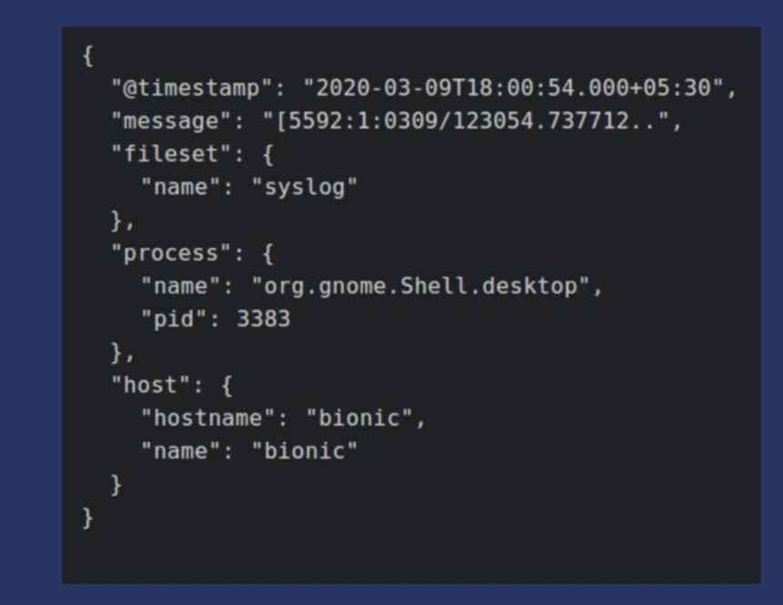
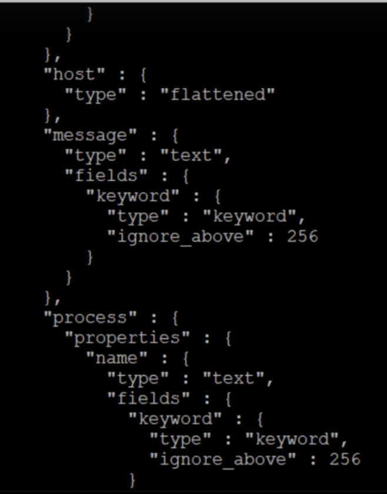

# mapping explosions 
내부 필드가 많은 문서를 처리해야 하는 경우 es 성능이 저하되기 시작할 수 있다.

이는 각각의 하위 필드가 기본적으로 동적 매핑을 통해 개별 필드에 매핑되기 때문이다.

### 문제
>ex)
>
>"fileset", "process" 및 "host"는 상위 필드이며 내부 필드를 포함하고 있을 때,
>로그를 보내는 프로세스의 시스템에 따라 이러한 상위 필드에 포함된 필드의 수가 변경될 수 있다.
>예측할 수 없는 수의 내부 필드가 생기며, '시간이 지남에 따라 변경 및 확장 될' 것이다.

- 이러한 내부 필드를 우리가 정의하지 않아도, es 는 기본적으로 모두 개별 필드에 대한 유형을 **자동 매핑**하게 되고, 이러한 것들이 **mapping explosions 을 일으킬 수 있는 것이기에 늘 염두해 두어야** 한다.

- 클러스터 내에서 마스터 노드는 최신 클러스터 상태를 다른 노드에 전송하고, 각 노드는 수신완료 신호를 다시 보낸다. 이때, 색인의 새 매핑 업데이트가 일어나면 클러스터 상태가 변경될 것이고, 클러스터 상태가 커질 뿐만 아니라, **모든 노드에서 클러스터 상태 업데이트를 촉발해 지연이 발생할 수** 있다.
  - 노드에서 클러스터 상태가 업데이트 되지 않으면, 색인화 및 검색과 같은 기본 작업조차 수행할 수 없게 되고,
  - 이로 인해 노드 내 메모리 문제가 발생하여 성능이 저하되고, 클러스터 자체가 작동 중단 될 수 있다.

 

=> 이렇게 mapping field가 너무 많아 클러스터가 충돌하는 경우를 **mappings explosions** 라고 한다.
=> **mapping explosions 에 도달하지 않도록 es는 모든 하위 필드를 개별 필드로 매핑하지 않고 원본 데이터를 포함해 매필할 수 있는 flattedned data type 을 제공헌다.**

# Flattend DataType
- 전체 개체와 내부 필드를 단일 필드로 매핑한다.
- 즉, 필드에 내부 필드가 포함된 경우, 플랫 데이터 유형은 **상위 필드를 플랫이라는 단일 유형**으로 매핑하고, **내부 필드는 매핑에 표시하지 않음**으로 전체 mapping felid 를 줄인다.
- 이 기능은 매핑 크기를 크게 줄이기 때문에 실 현업에서 많이 사용되는 중요한 기능이다.

### mappings
- host field 의 type을 flattened 유형으로 매핑

~~~
{
  "properties": {
    "host":{
      "type":"flattened"
    }
  }
}
~~~

- process, message 필드를 보면 내부 필드가 포함되어 있고, 매핑 유형이 나열되어 있지만, host를 보면 내부 필드가 매핑에 표시되지 않음을 볼 수있다. 여기서 host 에 내부 필드가 추가되도, 전혀 매핑되지 않고 아래와 동일한 결과를 볼 수 있다.

### 주의 및 제한 사향

1. flattened datatype 개체의 필드는 es 에서 **keyword** 로 처리된다.
   - 즉, 분석기 및 토크나이저가 적용되지 않아, **부분 일치 검색 결과를 반환할 수 없어,** 검색 기능에 제한됨.
2. 상위 필드를 대상으로 검색하더라도 검색 키워드를 사용하여 **모든 내부 필드가 검색**된다.
   1. 예를 들어, host 필드를 대상으로 검색했을 때, 검색어가 host 내 osVersion 내부 필드와 완전 일치하는 검색어라면 해당 문서가 나온다.
   2. 특정 내부 객체를 대상으로도 당연히 검색 가능. {"host.osVersion" : "Bionic Beaver"}
3. highlight 기능이 해당 필드에 활성화되지 않음.
   1. highlight 검색 결과를 통해 사용자에게 쿼리 일치 항목을 보여주는 기능인데, 해당 유형은 분석이 되지 않으니 당연히 불가.

### 정리
flattened datatype 는 필드 부분 검색 및 highlight 기능이 제한되더라도 많은 수의 필드 매핑을 처리하고 mapping explosions 을 방지하는 옵션이다.
