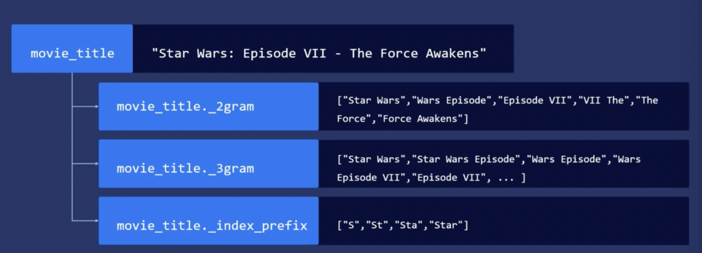

> **search as you type**
> 
> es 의 몇 가지 기능을 통해 검색어 자동완성, 몇 가지 검색 제안 기능을 구현할 수 있다.

# 1. query-time search-as-you-type
- 데이터를 특별히 색인화할 필요 없음.
- 접두사 쿼리 match_phrase_prefix 사용
- 이때 제목 필드가 text 로 분석되어 용어로 저장되었을 때 어떻게 적용되는지를 이해하자.

> ex. star trek 구절로 시작하는 제목이 검색되며
> slop 설정으로 구절 내 단어 순서를 유연하게 만든다.
> 
> trek star 등 정확히 일치하지 않고 용어 사이에 다른 내용이 포함되어도 제목을 검색해도 결과를 얻음.
>
> - star t 해도 star 용어가 일치하고 slop 값에 의해 star wars 가 나올 것.
> 
>- tr 하면 tr 접두사가 포함되는 용어가 든 star track 나옴.

~~~
{
    "query": {
        "match_phrase_prefix": {
            "title": {
                "query": "star trek",
                "slop":10
            }
        }
    }
}
~~~

### 단점
색인 기반 솔루션에 비해 리소스가 많이 사용된다. 역색인의 속성에는 접두사 매치를 효율적으로 만드는 기능이 있긴 하지만 여전히 상당히 많은 작업이 필요하다.

# 2. index-time with N-grams
- index-time 에서는 N-grams 이라는 개념을 사용하고 이를 search as you type 에 적용할 수 있다.
- 1번 방법의 단점으로 대규모 사이즈에선 index-time 솔루션이 반드시 필요하다.
- 색인 전에 설정해야 함.

### n gram
- n grams 으로 아래와 같이 토큰이 저장된다.
1. unigram [s,t,a,r]
2. bigram [st,ta,ar]
3. trigram [sta,tar]
4. 4-gram [star]
   
### edge N-grams
주어진 구절이나 검색어의 **시작 n-gram** 만 계산되어 토큰이 저장된다.

1. unigram [s]
2. bigram [st]
3. trigram [sta]
4. 4-gram [star]

### ex. autocomplete with edge N-grams
1. create custom analyzer
- token은 모두 소문자로 바뀌고, edge-n gram 을 통해 s, st, sta, star 가 저장된다.

~~~
{
  "settings": {
    "analysis": {
      "analyzer": {
        "auto_analyzer": {
          "type": "custom",
          "tokenizer": "standard",
          "filter": [
            "lowercase",
            "autocomplete_filter"
          ]
        }
      },
      "filter": {
        "autocomplete_filter": {
          "type": "edge_ngram",
          "min_gram": 1,
          "max_gram": 20
        }
      }
    }
  }
} 
~~~

2. index-time 적용 - mappings 
~~~
{
    "properties": {
        "title": {
            "type": "text",
            "analyzer": "autocomplete"
        }
    }
}
~~~

3. search
- query 구문에 표준 분석기 사용해야 함. 검색어를 ngram 하는 게 아니라, 색인에서 만든 n gram 과 매치하는 것.
- standard 안 하면 n-gram 설정이 title 필드 검색어에도 적용되어, s,st,sta 로 토큰화하여 모두 찾을 것이다.
- 이때, star t 를 검색해도, star wars 가 나올 것이다. title 은 text 유형으로 분석하기 때문에, star 가 일치하므로, 나옴. 이러한 상황을 막고 싶다면 completion suggesters 를 사용

~~~
{
    "query": {
        "match":{
            "title": {
                "query":"sta",
                "analyzer":"standard"
            }
        }
    }
}
~~~

### shingle
- NGram 과 Edge NGram은 둘다 하나의 단어로부터 토큰을 확장하는데,
- 이때, 문자가아니라 **단어 단위**로 구성된 묶음을 Shingle 이라고한다
- "type": "shingle" 토큰 필터를 적용한다.
- min_shingle_size / max_shingle_size : shingle의 최소 / 최대 단어 개수를 지정. 디폴트는 모두 2 

### ex
- filter
~~~
{
  "settings": {
    "analysis": {
      "filter": {
        "my_shingle_f": {
          "type": "shingle",
          "min_shingle_size": 3,
          "max_shingle_size": 4
        }
      }
    }
  }
}
~~~

- "this is my sweet home" 문장 분석
~~~
GET my_shingle/_analyze
{
  "tokenizer": "whitespace",
  "filter": [
    "my_shingle_f"
  ],
  "text": "this is my sweet home"
}

{
  "tokens" : [
    {
      "token" : "this",
      "start_offset" : 0,
      "end_offset" : 4,
      "type" : "word",
      "position" : 0
    },
    {
      "token" : "this is my",
      "start_offset" : 0,
      "end_offset" : 10,
      "type" : "shingle",
      "position" : 0,
      "positionLength" : 3
    },
    {
      "token" : "this is my sweet",
      "start_offset" : 0,
      "end_offset" : 16,
      "type" : "shingle",
      "position" : 0,
      "positionLength" : 4
    },
    {
      "token" : "is",
      "start_offset" : 5,
      "end_offset" : 7,
      "type" : "word",
      "position" : 1
    },
    {
      "token" : "is my sweet",
      "start_offset" : 5,
      "end_offset" : 16,
      "type" : "shingle",
      "position" : 1,
      "positionLength" : 3
    },
    {
      "token" : "is my sweet home",
      "start_offset" : 5,
      "end_offset" : 21,
      "type" : "shingle",
      "position" : 1,
      "positionLength" : 4
    },
    {
      "token" : "my",
      "start_offset" : 8,
      "end_offset" : 10,
      "type" : "word",
      "position" : 2
    },
    {
      "token" : "my sweet home",
      "start_offset" : 8,
      "end_offset" : 21,
      "type" : "shingle",
      "position" : 2,
      "positionLength" : 3
    },
    {
      "token" : "sweet",
      "start_offset" : 11,
      "end_offset" : 16,
      "type" : "word",
      "position" : 3
    },
    {
      "token" : "home",
      "start_offset" : 17,
      "end_offset" : 21,
      "type" : "word",
      "position" : 4
    }
  ]
}
~~~

# 3. type-as-you-search-datatype
~~~
type : search_as_you_type
~~~

data 를 search as you type 유형으로 색인화, 매핑할 수 있다.

es는 **원본 텍스트를 n-gram 으로 분할해 신속히 부분 매치할 수 있도록 여러 하위 필드를 자동으로 생성**한다.
아래와 같이 색인된다.

- n gram 은 문장이나 단어 사이를 이동하며 부분적인 텍스트나 단어를 추출한 뒤 색인화해, 사용자가 입력하는 순간마다 부분 매치시킨다.
- n gram 은 필드가 search as you type 유형으로 매핑된 경우 텍스트 분석 단계에서 생성된다.
- 2gram, 3gram 을 보면 shingle 으로 토큰화된 것을 볼 수 있다.

### ex
1. search_as_you_type mappings

~~~
curl --request PUT 'http://localhost:9200/autocomplete' \
-d '{
   "mappings": {
       "properties": {
           "title": {
               "type": "search_as_you_type"
           },
           "genre": {
               "type": "search_as_you_type"
           }
       }
   }
}'
~~~

2. search api
- multi-match
  - search as you type 의 세 개의 하위 필드를 대상으로 검색할 것이기에
- bool_prefix
  - 순서와 상관없이 검색어를 매치할 수 있고, 검색어가 같은 순서로 있으면 더 높은 점수를 부여함.

~~~
curl -s --request GET 'http://localhost:9200/autocomplete/_search?pretty' --data-raw '{
   "size": 5,
   "query": {
       "multi_match": {
           "query": "Sta",
           "type": "bool_prefix",
           "fields": [
               "title",
               "title._2gram",
               "title._3gram"
           ]
       }
   }
}
~~~

ex. 자동완성 

~~~
while true
do
 IFS= read -rsn1 char
 INPUT=$INPUT$char
 echo $INPUT
 curl --silent --request GET 'http://localhost:9200/autocomplete/_search' \
 --data-raw '{
     "size": 5,
     "query": {
         "multi_match": {
             "query": "'"$INPUT"'",
             "type": "bool_prefix",
             "fields": [
                 "title",
                 "title._2gram",
                 "title._3gram"
             ]
         }
     }
 }' | jq .hits.hits[]._source.title | grep -i "$INPUT"
done
~~~

# 4. completion suggesters
해당 메커니즘을 통해 완료 목룍을 미리 업로드할 수 있다.

효율성과 자동완성 기능을 완벽하게 통제하고 싶다면 해당 메터니즘을 사용해야 한다.
